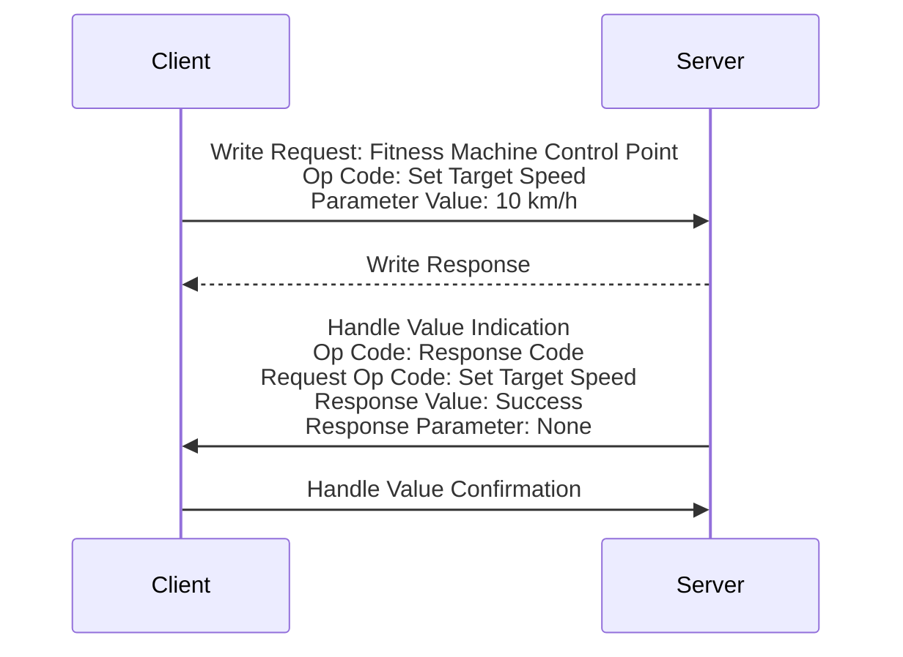
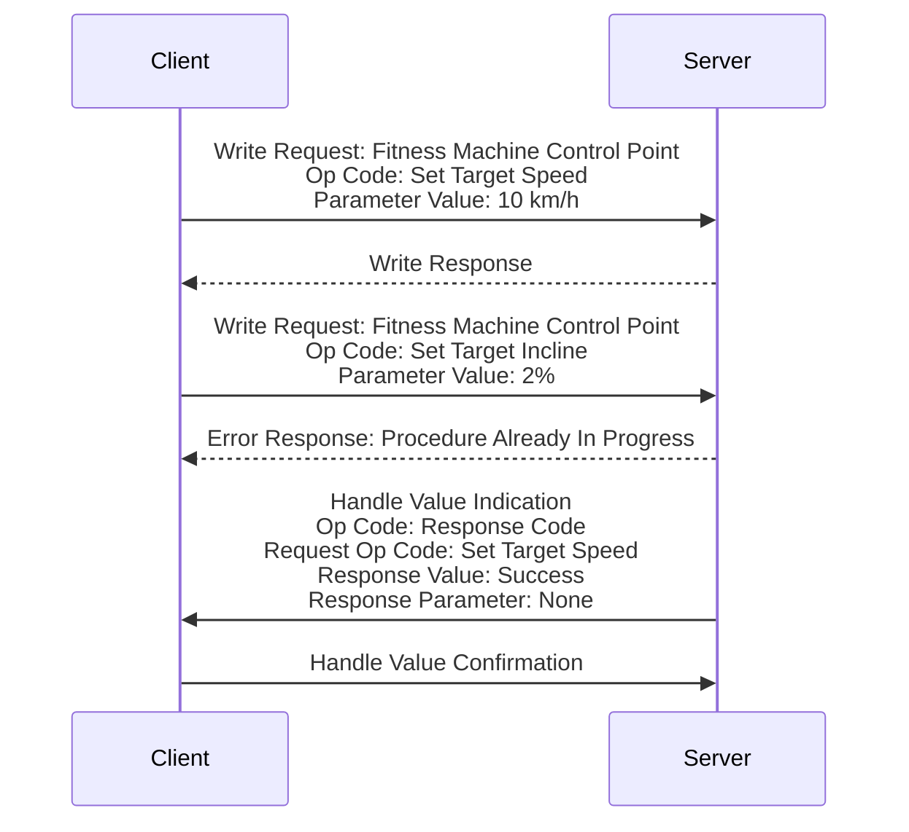
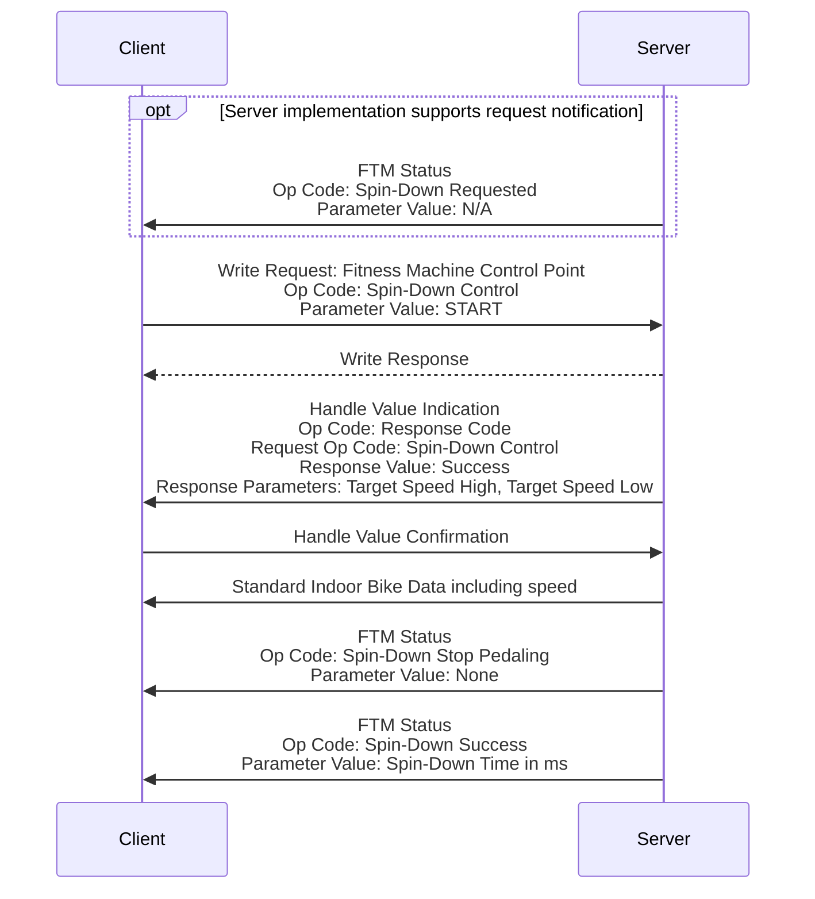
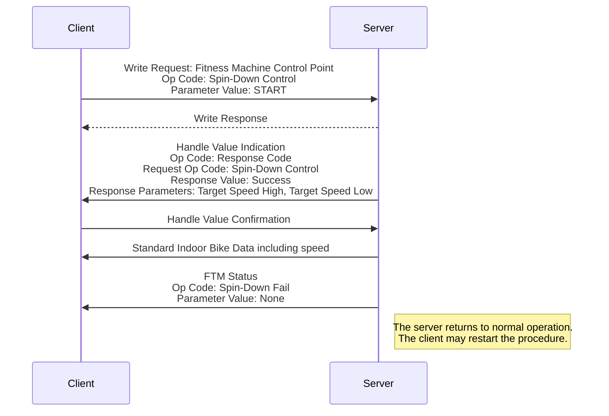
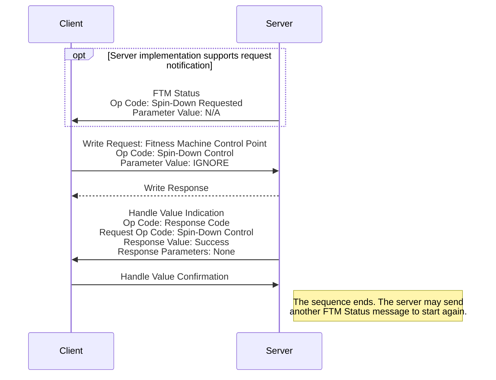

<!-- markdownlint-disable MD001 MD012 MD013 MD024 MD025 -->

# Appendices

## Appendix 1 Transmission of a Data Record

## A.1.1 Sending Data Record in a Single Notification

When a Data Record fits into a single notification, the More Data bit of the Flags field is set to 0, and the related fields are also present.

## A.1.2 Sending Data Record Split into Multiple Notifications

When a Data Record does not fit in a single ATT\_MTU payload, it is split into multiple notifications. The content of the notifications is as follows:

First notification:

- More Data bit of the Flags field is set to 1
- Some fields are present
- Fields related to the More Data bit are not present

Next notifications (if any):

- More Data bit of the Flags field is set to 1
- Some other fields are present
- Fields related to the More Data bit are not present

Last notification:

- More Data bit of the Flags field is set to 0
- Remaining fields are present
- Fields related to the More Data bit are present

## Appendix 2 Fitness Machine Control Point Message Sequence Charts

## A.2.1 Control Procedure

The message sequence chart described below applies to all Fitness Machine Control Point procedures defined in Section 4.16. Note that the Request Control Procedure was executed prior to initiating the procedure described below.

## A.2.2 Error Handling - Procedure Already In Progress

The message sequence chart described below results in a bad behavior of the Client. However, this mechanism is implemented by a Server in order to handle this situation. Note that the Request Control Procedure was executed prior to initiating the procedure described below.

This request is discarded by the Server.

## Appendix 3 Spin Down Procedure Examples

## A.3.1 Spin Down Procedure - Requested by the Server

The message sequence chart described below applies to the Spin Down Control procedures defined in Section 4.16.2.20. Note that the Request Control Procedure was executed prior to initiating the procedure described below.

## A.3.2 Spin Down Procedure - Initiated by the Client with Error

The message sequence chart described below applies to the Spin Down Control procedures defined in Section 4.16.2.20. Note that the Request Control Procedure was executed prior to initiating the procedure described below.

## A.3.3 Spin Down Procedure - Ignored by the Client

The message sequence chart described below applies to the Spin Down Control procedures defined in Section 4.16.2.20. Note that the Request Control Procedure was executed prior to initiating the procedure described below.

